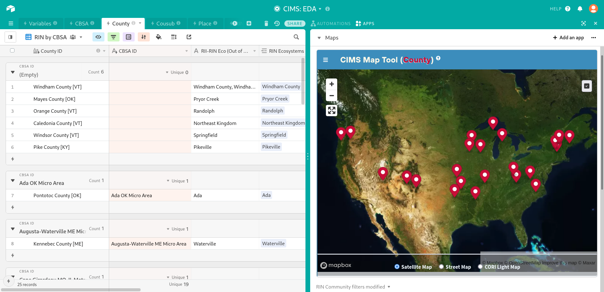
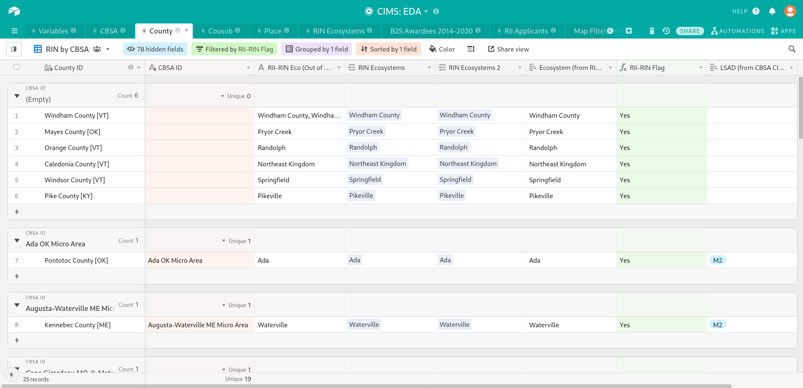
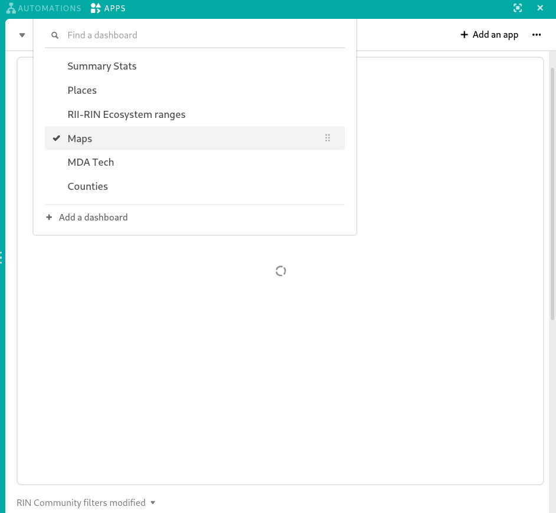
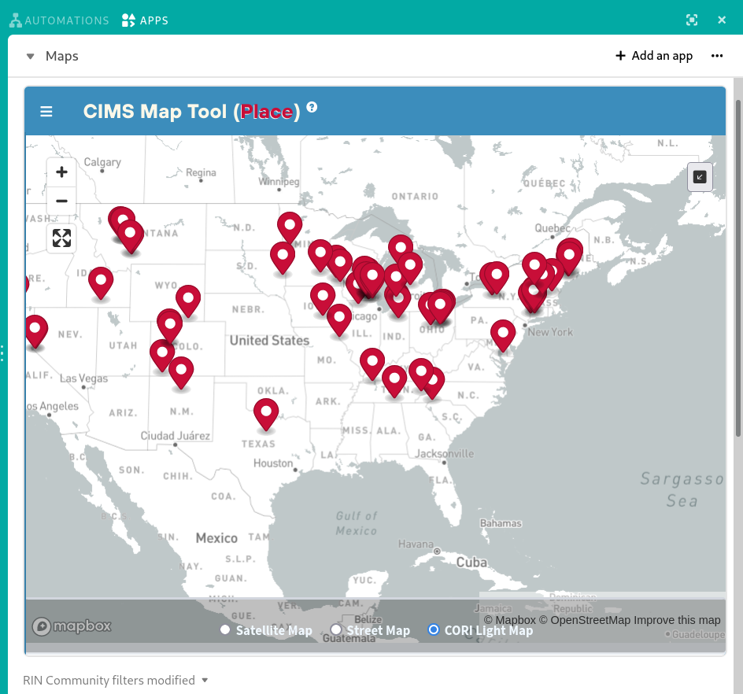
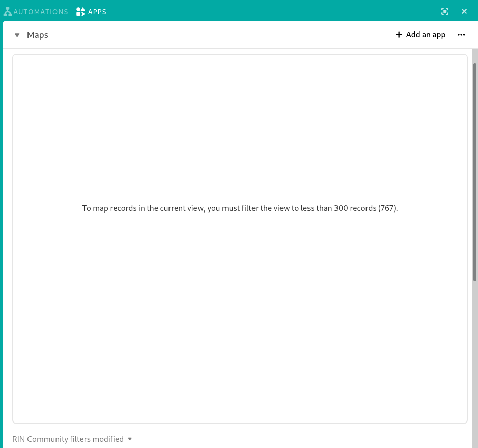
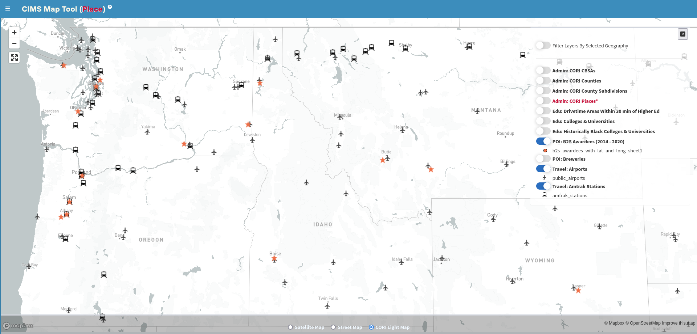
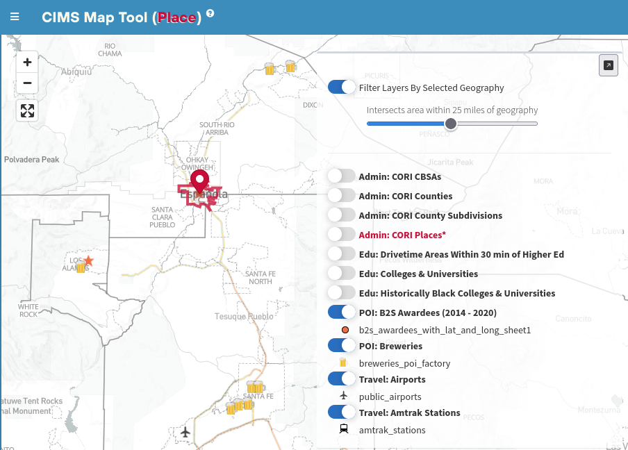

# (Airtable) CIMS Map Tool
Welcome to the CIMS map tool, as it is currently deployed on [CIMS: EDA Airtable base](https://airtable.com/app0hTxEwsHVfhmJg/tblGPS8wgl4NU4WmI/viwGHKSFU9TRoTQem?blocks=hide).

If you use the link provided above (in which query parameter “blocks” = “hide”), then Airtable will initially load this base with the “Apps” panel hidden or collapsed to the right-hand side.

This is the recommended way to initially load any CIMS Airtable base to allow overhead for the processing time that the base will require from your browser in order to load the sheer volume of records. Once the base has finished loading and you can easily navigate the records of either the County table or Place table, click the “Apps” button in the upper right-hand corner and then make sure that “Maps” is selected within the dashboard dropdown menu (accessible by clicking the triangle under “Automations”, near “Apps”).

Once the “Maps” dashboard within the “Apps” panel has been activated, it may take anywhere from 30 - 60 seconds for the CIMS Map Tool application to initialize and show a simple basemap with drop pin markers representing records from the current view of either the County or Place table. This depends on which of those two tables you most recently accessed within the base. If you begin on the County table and then click on the Place tab to display a view of the Place table, the map will re-initialize, showing records from that view.

However, the map has a maximum viewable records size of 300, so if the current view contains more than 300 records, it will not be mapped and instead a text message alerting you to this fact will be shown.

View changes are not immediately reflected in the map. At the moment, in order to sync changes to the current view to the map view, you must click on either another view in the current table (i.e. County or Place table), or another mappable table (i.e. if you’re on Place, switch to County), and then click back to the view you were modifying. The map will reset and show the modifications to the parameters/records of that view. Initializing and resetting the map can be a slow process, so the recommended workflow is to keep the map view (or the entire “Apps” panel) hidden, while you work on filtering the list in your current view, then activate the map when you are ready to explore and/or validate contextual geographic and spatial details about individual records or the list as a whole.

In order to better understand the geographic context of the selected location(s), the right-hand panel (which is initially collapsed and hidden, so to view it you must expand the Apps view    and  then  click the  button in the upper right corner of the map view), allows you to selectively turn on a single polygon (boundary) feature layer or multiple point feature layers. An example of how these contextual layers can provide insight is the observation that virtually all of the previous B2S award winning communities are located in close proximity to either a commercial airport, an Amtrak train station, or both.

 _CIMS Map Tool filter_ 
_showing an airport and_ 
_breweries found within_ 
_25 miles of Española,_ 
_a previous B2S awardee,_ 
_as well as the proximity_ 
_to the Los Alamos Com-_ 
_merce and Development_ 
_Corporation, another B2S_ 
_Awardee (star)._ 

In the example above, a Place location has been selected, either by clicking on the record in the current View within the Place table or clicking on the drop pin marker on the map which represents that place. This will direct the map to zoom in on the location and any other active controls (right-hand panel) will function with respect to that location. For instance, simply toggling on the “Filter Layers By Selected Geography” control will filter all currently enabled point layers so that only features that are within the bounds of that selected location (or a given buffer around that location, as set by the slider) will be shown. Enabling any of the polygon layers (“CORI CBSAs”, “CORI Counties”, “CORI Subdivisions”, “CORI Places”, and “Drivetime Areas Within 30 min of Higher Ed[ucation]”) will similarly only show those polygons that are within or intersecting with the bounds of that location. There’s a special case for either “CORI Counties” when the location itself is a county boundary or “CORI Places” when the location is a place boundary - in this case there should be single feature polygon that is identical to the location boundary. When a polygon layer is turned, it acts as the filter within which features of any subsequently enabled point layer will be shown. Experiment with this feature to get a better understanding of this mode of operation.
